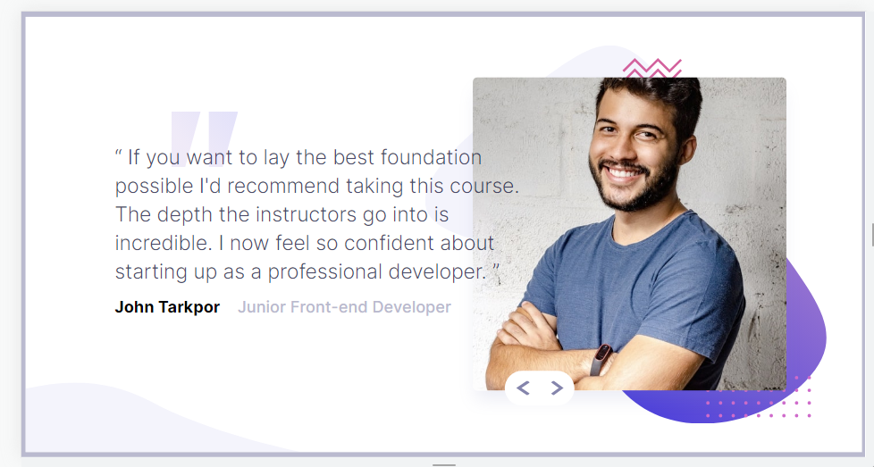

# Frontend Mentor - coding bootcamp testimonials

## Table of contents

- [Overview](Interactive card details form)
- [Built with](HTML, CSS, React.js)
- [Author](Papuna Fshaveli)

### The challenge

Users should be able to:

- View the optimal layout for the component depending on their device's screen size
- using either their mouse/trackpad or keyboard

### Screenshot

### Built with

- Semantic HTML5 markup
- CSS custom properties
- Flexbox
- Mobile-first workflow
- React.js

## Author

- Github - [Papuna Fshaveli](https://github.com/papunafshaveli)
- Facebook - [@papunafshaveli](https://www.facebook.com/papunafshaveli)
